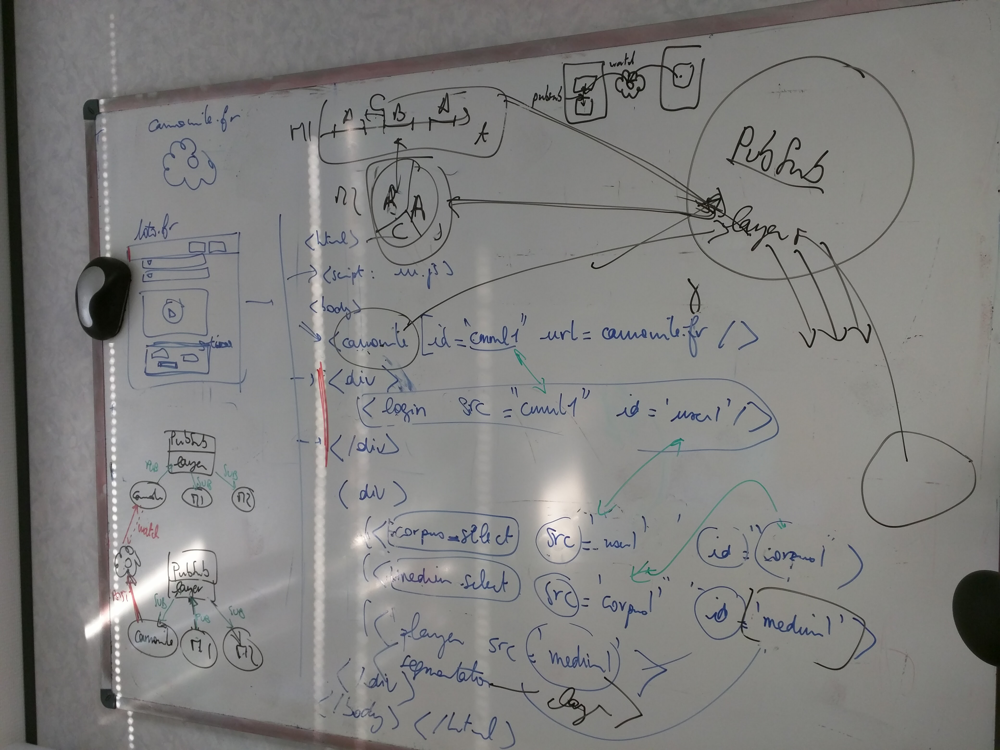

# camomile-polymer-client

## Demo

You will be able to try it on the github pages demo at [https://paulalbert31.io/camomile-polymer-client/](https://camomile-project.github.io/camomile-polymer-client/)
(using `https://camomile.rom1504.fr` as the endpoint, `root` as user and `test` as password)__NOT AVAILABLE FOR NOW__

## Specifications



The objective of this project is to define [web components](https://www.webcomponents.org/) using [polymer](https://www.polymer-project.org/)
to make it easier to create camomile clients.

Examples :
* index.html with my-app.html and camomile-admin.html and camomile-annotation.html
* a one file example in simple-demo.html

## Implementation

Polymer 2.0 will be used to implement these components.

[polymer 2.0 quick start](https://www.polymer-project.org/2.0/start/quick-tour) explains that polymer components are defined as classes.
So defining the needed components for camomile will consist in defining the relevant classes.

## Installation

* npm install -g polymer-cli
* npm install -g bower
* npm install
* bower install

## Run

* polymer serve

## Deploy to github pages

* npm run gh-publish

## Components

Here you can find a description of the components added to the camomile project

###  Camomile-touch-player

This is the main component of the touch implementation, allow a component inherited from camomile-touch-action (described bellow) to interact with the player. It wraps the video element with a touch layer and adds a SVG overlay to allow you to draw on the video.
The SVG "drawing board" is accessible through ```this.draw``` attribute (see the [SVG.js documentation](svgjs.com))
The touch events are passed on to the player (camomile-touch-player) itself. This player only recognize the following actions : __singletap, doubletap, pinch, pan__. (see Recognizers in the HammerJS documentation : [HammerJS Doc](http://hammerjs.github.io/recognizer-pan/)).

If you want to implement more actions, you can either change the code in the wrap() function : add lines after line 96 using the function hammer.add() (see HammerJS documentation : [HammerJS Doc](http://hammerjs.github.io/api/#utils))

You can also inherit the component Camomile-touch-player using ```class YourModifiedPlayer extends CamomileTouchPlayer``` when defining your component. Don't forget to import the component at the top of your html document : ```<link rel="import" href="camomile-touch-player.html">```.

You can then modify the wrap() function of your inherited class (working on a easier way to modify the recognize functions)


### Camomile-touch-action

This element allows you to choose what to do when the different events allowed by the player happens. The following actions are detected : __singletap, doubletap, pinch, pan__. (see Recognizers in the HammerJS documentation : [HammerJS Doc](http://hammerjs.github.io/recognizer-pan/)). To add your own recognizers, see the above paragraph.

You can inherit this element to implement your own functions. Use the line ```class YourModifiedAction extends CamomileTouchPlayer``` to define your inherited class and don't forget to include the original element : ```<link rel="import" href="camomile-touch-action.html">```.

To change the actions performed on events, rewrite the setFunctions() method.
You can then use the variable ```this.player``` (provided you didn't rewrite the ```ready()``` function) that allows you to access the Camomile-touch-player element (or the element inherited from camomile-touch-player)
To execute a function on a event recognized by the player element, just use the this.player.on(event,function) function, with ```event``` being a recognized event and ```function``` a function to execute when the event occurs (much like the [addEventListener() method](https://developer.mozilla.org/en-US/docs/Web/API/EventTarget/addEventListener))

The Camomile-touch-player element is also equipped with a SVG layer which you can draw on. It is accessible through the Camomile-touch-action with the attribute (```this.player.draw```) which contains the SVG "drawing board" see the [SVG.js documentation](svgjs.com).

### Camomile-download

This component is used to allow users of the camomile project to download annotations to their computers. The generation of the file that will be downloaded on the client's computer is done on the client side. You can use this component by default, the downloaded file will be in the JSON format. However, you can inherit this element through the line ```class YourModifiedDownload extends CamomileDownload``` this will allow you to change the format of the file and the way the annotations are parsed.
Don't forget to import the element camomile-download at the top of your document : ```<link rel="import" href="camomile-download.html">```.
The main functions to rewrite are ```_extention()``` that should return, as a string, the file extention (for example '.cam') and the ```_format(annotations)``` function that parses the annotations from the server, returning the parsed annotations.
The element Camomile-download-cam is an example of what an inherited component should look like.

### Camomile-upload

Much like the previous component, Camomile-upload allows the user to upload an annotation file to the server. Inherit from this component to parse the informations of the file correctly.
```class YourModifiedUpload extends CamomileUpload``` will extend the class provided you imported it earlier on : ```<link rel="import" href="camomile-upload.html">```.
The function you should rewrite is ```_fileAction(file)```. You can use camomile-upload-cam as an example on how it works. This function will be simplified in the futur to make it easier for the user.

### Camomile-draw

This element allows us to draw rectangle around the head of the character appearing on the screen. It uses the "drawing broad" from the Camomile-touch-player to draw shapes. You could inherit from this document to create your own overlay on a video.
The two main functions to rewrite would then be ```_popAnnos(data)``` and ```updateSVG(i)```. You can access the SVG overlay through ```this.player.draw```.
